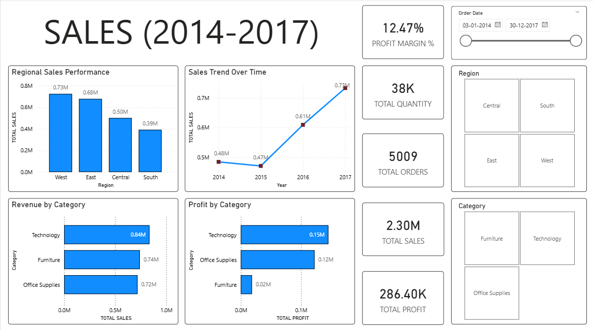
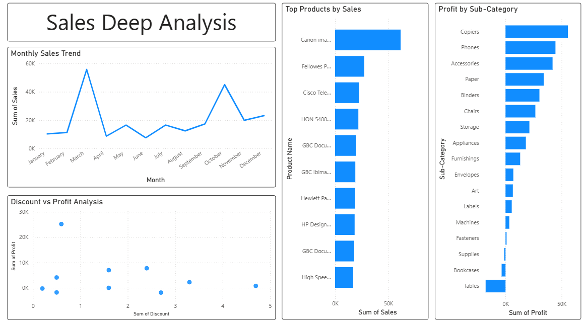

powerbi-sales-dashboard
│
├── dashboard_page1.png
├── dashboard_page2.png
├── sales_dashboard.pbix
├── superstore_dataset.csv
├── sales_2014_2017_dashboard.pdf
└── README.md

# Power BI Sales Dashboard

## Project Overview
This project analyzes retail sales data from 2014–2017 using Power BI.  
The dashboard provides insights into sales performance, product profitability, and discount impact.

## Key Metrics
Total Sales: $2.3M  
Total Profit: $286K  
Total Orders: 5,009  
Total Quantity: 38K  
Profit Margin: 12.47%

## Dashboard Features
- Executive Overview with KPI metrics
- Regional Sales Performance
- Monthly Sales Trend Analysis
- Top Products by Sales
- Profit by Sub-Category
- Discount vs Profit Analysis

## Tools Used
Power BI  
Data Visualization  
Data Analysis  
Business Intelligence

## Key Insights
- West region generated the highest sales.
- Technology category produced the highest profit.
- Tables sub-category showed negative profitability.
- Higher discounts may reduce profit margins.

## Files in This Repository
sales_dashboard.pbix – Power BI report file  
sales 2014-2017.pdf – Dashboard export  
Superstore dataset.csv – Original dataset

## Dashboard Preview

### Executive Overview

### Sales Deep Analysis

